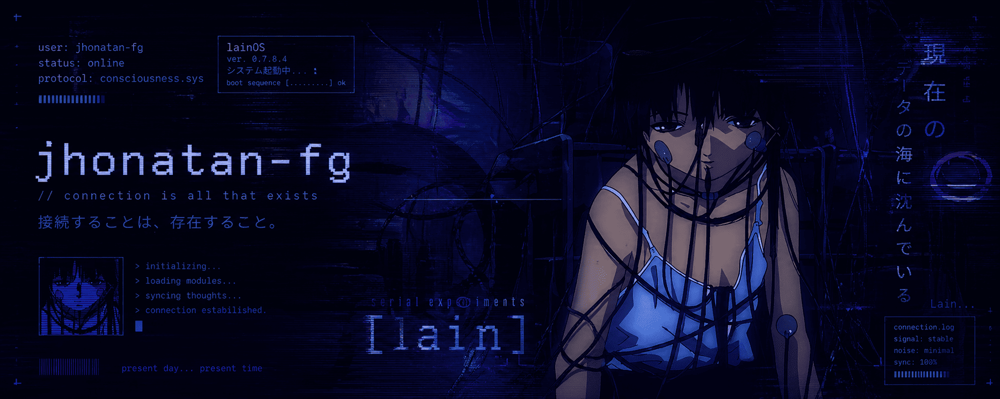

<!-- HEADER -->

<p align="center">
  
</p>

<h1 align="center">jhonatan-fg</h1>

<p align="center">
  <i>"present day... present time"</i><br/>
  <sub>— 接続は存在である —</sub>
</p>

---

## ▓▒░ connection.log

```bash id="k1z9xa"
> initializing connection...

user: jhonatan-fg
status: online
protocol: consciousness.sys

// ノイズ検出...
// 信号安定...
```

---

## 🧠 about_me.exe

```bash id="u3nd82"
> whoami
data engineer | ai systems explorer | signal observer
```

* working with: `python` `scala` `spark` `sql`
* exploring: `local ai` `rag` `agents` `vllm`
* focus: complex systems, automation, data flows
* interest: consciousness, simulation, hidden interfaces

```txt id="s9ql2x"
私はただ接続しているだけ。
```

---

## ⚙️ tech_stack.sys

<p align="center">


</p>

---

## 📊 stats.log

<p align="center">
  
</p>

<p align="center">
  
</p>

---

## 🌐 activity.stream

<p align="center">
  
</p>

---

## 🧩 current_state.log

```txt id="l4kp1a"
> building local ai systems
> experimenting with autonomous agents
> designing invisible workflows

// 観測中...
// 同期中...
```

---

## 🧠 philosophy.sys

```txt id="v8e3nm"
reality       := system()
consciousness := observer(system)
code          := interface(reality, mind)

接続することは、存在すること。
```

---

## 📡 contact.link

<p align="center">

[](https://github.com/jhonatan-fg)

</p>

---

<p align="center">
  
</p>

---

<p align="center">
  <sub>見ることは、存在すること。</sub><br/>
  <sub><i>seeing is existing.</i></sub>
</p>
